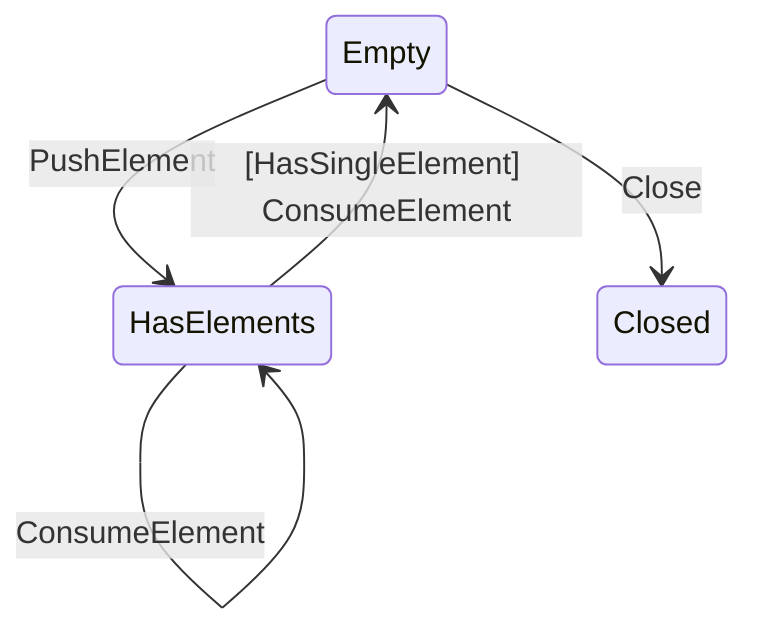

<!---
Autogenerated. Do not modify.

This file can be regenerated by running
go run github.com/arnavdugar/hsm/codegen -i=machine.yaml -o=machine.go
--->
# State Machine

```mermaid
stateDiagram-v2
  Empty --> HasElements: PushElement
  Empty --> Closed: Close
  HasElements --> HasElements: PushElement
  HasElements --> Empty: [HasSingleElement] ConsumeElement
  HasElements --> HasElements: ConsumeElement
```
